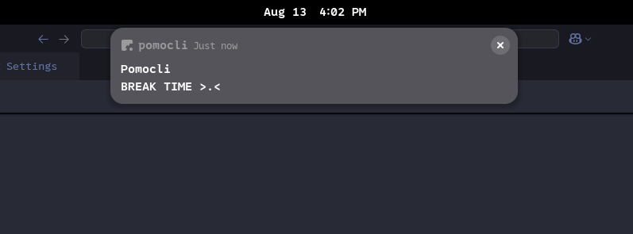

<div align="center">

# Pomocli

### A terminal-based Pomodoro timer with desktop notifications


[Features](#features) •
[Installation](#installation) •
[Usage](#usage) •
[Configuration](#configuration) •
[Showcase](#showcase)

</div>

---

## What is Pomocli?

**Pomocli** is a simple, configurable Pomodoro timer that lives in your terminal. Stay focused, take breaks, and boost productivity with desktop notifications—all without leaving your command line.

### The Pomodoro Technique

The Pomodoro Technique is a time management method that breaks work into focused intervals:
- **25 minutes** of concentrated work
- **5 minutes** of short break
- After **4 pomodoros**, take a **15-30 minute** long break

This rhythm helps maintain focus, prevent burnout, and improve productivity.

---

## Features

- **Terminal-based interface** - Runs entirely in your terminal with ASCII art display
- **Desktop notifications** - Get notified when it's time to work or take a break
- **Fully configurable** - Customize work/break durations and notification messages
- **JSONC config** - Use comments in your configuration file for better organization
- **Automatic cycles** - Tracks pomodoros and automatically triggers long breaks
- **Lightweight** - Written in Rust for minimal resource usage

---

## Showcase

### In Action


### Desktop Notifications



---

## Installation

### Prerequisites

- Rust toolchain (install from [rustup.rs](https://rustup.rs/))
- A terminal that supports ANSI colors

### Install Globally (recomended)

```bash
# Copy the binary to a location in your PATH
sudo cp pomocli /usr/local/bin/

# Now you can run it from anywhere
pomocli
```

---
## on windows just run the .exe file

## Usage

Simply run the command to start your Pomodoro session:

```bash
pomocli
```

The timer will:
1. Start with a work session (default: 25 minutes)
2. Notify you when it's break time
3. Alternate between work and breaks
4. Give you a long break after 4 pomodoros

**Pro tip:** Keep the terminal visible while you work, or minimize it and rely on desktop notifications.

---

## Configuration

Pomocli creates a configuration file at `~/.config/pomocli/config.jsonc` on first run.

### Configuration Options

```jsonc
{
  // Pomodoro work duration in minutes
  "work_minutes": 25,

  // Short break duration in minutes
  "break_minutes": 5,

  // Long break duration in minutes
  "long_break_minutes": 15,

  // Number of pomodoros before a long break
  "pomodoros_before_long_break": 4,

  // Messages for desktop notifications
  "work_message": "TIME TO WORK :(",
  "break_message": "BREAK TIME >.<",
  "long_break_message": "LONG BREAK >.<!!"
}
```

### Customization Examples

**Short sprints for deep focus:**
```jsonc
{
  "work_minutes": 50,
  "break_minutes": 10,
  "long_break_minutes": 30,
  "pomodoros_before_long_break": 3
}
```

**Quick iterations:**
```jsonc
{
  "work_minutes": 15,
  "break_minutes": 3,
  "long_break_minutes": 10,
  "pomodoros_before_long_break": 6
}
```

After editing the config, simply restart `pomocli` for changes to take effect.

---

## Why Pomocli?

This project was born from a simple need: a terminal-based Pomodoro timer that's easy to configure without repeatedly typing commands. It's also a learning project exploring Rust's capabilities for building CLI tools with:
- Terminal UI rendering with ASCII art
- Desktop notification integration
- JSONC configuration parsing
- Cross-platform compatibility

---

## Tech Stack

- **Language:** Rust 2024 edition
- **Terminal rendering:** figlet-rs, terminal_size
- **Notifications:** notify-rust
- **Configuration:** serde, json_comments

---

## License

This project is licensed under the MIT License - see the [LICENSE](LICENSE) file for details.

---

## Contributing

Contributions are welcome! Feel free to:
- Report bugs
- Suggest new features
- Submit pull requests

---

<div align="center">

**Happy focusing!**

Made with Rust

</div>


